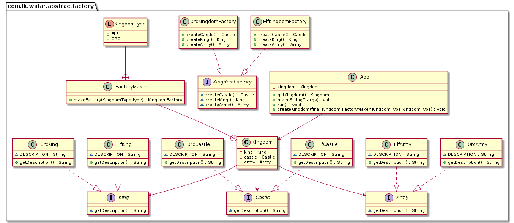
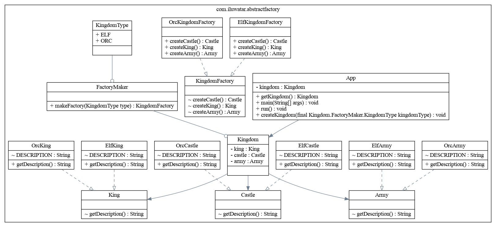
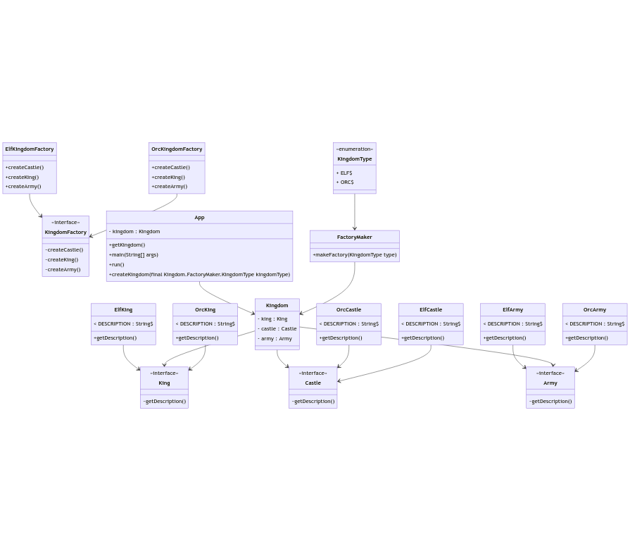

# Yet Another Java to UML (yajauml)

Existing tools not serving you perfectly well? 
Here is yet another solution to reverse Java source code into UML class diagrams!

Using the amazing [JavaParser](http://javaparser.org/), **yajauml** scans a folder containing Java source code and parses classes and relationships between them. 

As a fork of the inspiring [UML Reverse Mapper](https://github.com/iluwatar/uml-reverse-mapper), **yajauml** outputs an UML class diagram as a [PlantUML](http://www.plantuml.com/) .puml file, a [Graphviz](https://www.graphviz.org/) .dot file, or a [Mermaid](https://mermaid-js.github.io/mermaid/#/) .mmd file. 

Unlike UML Reverse Mapper, you don't need to build your Java project before generating your class diagram using **yajauml**.

# Building from sources


1. Clone the repo:
   ```
   git clone https://github.com/AndreaInfUFSM/yetanother-java2uml.git
   cd yetanother-java2uml
   ```

2. Use the Gradle wrapper to build the all-in-one `yajauml.jar` file (including runtime dependencies):
   ```
   ./gradlew jar
   ```


# Usage

1. Run `yajauml.jar` over a folder containing Java classes to output a class diagram description in PlantUML (default) format:

   ```
   java -jar yajauml/build/libs/yajauml.jar -d "yajauml/src/test/java/yajauml/testdomain/abstractfactory" -f abstractfactory.puml
   ```

2. Grab the output and feed it to a downloaded [PlantUML release](https://github.com/plantuml/plantuml/releases/) to generate a PNG image:
   ```
   java -jar plantuml-1.2022.0.jar abstractfactory.puml 
   ```

# Options

Here is the full list of **yajauml** options:
```
usage: java -jar yetanother-java2uml.jar
 -d <directory>    directory to search for .java files
 -f,--file <arg>   write to file
 -i <ignore>       comma separated list of ignored types
 -s <presenter>    presenter format to be used: plantuml, graphviz or mermaid
```


# Examples

Here are some class diagrams generated with **yajauml**:

## PlantUML





Do it yourself!

Step 1: **yajauml**
```
java -jar yajauml/build/libs/yajauml.jar -d "yajauml/src/test/java/yajauml/testdomain/abstractfactory" -f examples/abstractfactory.puml
```
Step 2: PlantUML
```
cat examples/abstractfactory.puml | java -jar plantuml-1.2022.0.jar -pipe > examples/plantuml-abstractfactory.png
```

Alternatives to Step 2: 
You don't have downloaded PlantUML? No problem! You can paste the contents of `abstractfactory.puml` into PlantUML online server (http://www.plantuml.com/plantuml/) or PlantText UML Editor (https://www.planttext.com/).


## Graphviz



Wanna do it yourself?

Step 1: **yajauml**
```
java -jar yajauml/build/libs/yajauml.jar -d "yajauml/src/test/java/yajauml/testdomain/abstractfactory" -s graphviz -f examples/abstractfactory.dot
```

Step 2: Graphviz (dot)
```
dot -Tpng examples/abstractfactory.dot > examples/graphviz-abstractfactory.png
```

Alternatives to step 2: There are many interactive viewers listed in https://graphviz.org/resources/. You just have to chose a cloud-based editor like Graphviz Online (https://dreampuf.github.io/GraphvizOnline) or Edotor (https://edotor.net/) and paste the contents of `abstractfactory.dot` into it.


## Mermaid




Let's to it!

Step 1: **yajauml**
```
java -jar yajauml/build/libs/yajauml.jar -d "yajauml/src/test/java/yajauml/testdomain/abstractfactory" -s mermaid -f examples/abstractfactory.mmd
```

Step 2: Mermaid

Paste the contents of `abstractfactory.mmd` into the Mermaid Live Editor at https://mermaid.live.


Alternatives to Step 2: Mermaid.js is also available as an API and integrates with other tools, as described in this [documentation](https://mermaid-js.github.io/mermaid/#/n00b-gettingStarted?id=four-ways-of-using-mermaid).


# Known limitations

- UML class diagram relationships: **yajauml** identify class relationshipts as either inheritance, implementation or a "loose" form of association (which comprises nested classes), without distinguishing between aggregation or composition. Besides, **yajauml** does not deal with cardinality/multiplicity or other qualifiers.

- As with [UML Reverse Mapper](https://github.com/iluwatar/uml-reverse-mapper), diagrams generated with **yajauml** may slightly differ when representing relationships in PlantUML, Graphviz or Mermaid, because some arrow types/lines differ in these formats.

- Nested classes, static or abstract classes are identified, but their representation is more detailed in PlantUML format. Besides, in Graphviz format, there is no visual ditinction between classes, interfaces or abstract classes.

- Testing: so far, we've only done manual testing with a few projects containing an "assortment" of Java code. It may be possible to reuse some test cases from uml-reverse-mapper to implement automated tests. 

<!-- # Comparing related tools -->